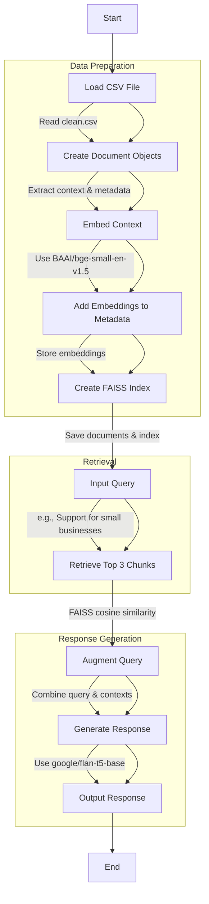

# Government Schemes Information Retrieval System

Created a Streamlit App


## Overview
This project implements a retrieval-augmented generation (RAG) system for querying information about government schemes in India. It processes CSV data containing scheme details, generates embeddings for semantic search, and provides concise responses to user queries using a transformer-based model.




## Features
- **Data Cleaning**: Removes HTML tags, special characters, and extra whitespace from CSV data.
- **State Extraction**: Identifies applicable states or regions for each scheme based on eligibility and description.
- **Document Creation**: Converts CSV rows into JSON documents with context and metadata.
- **Embedding Generation**: Uses SentenceTransformers (`BAAI/bge-small-en-v1.5`) to create embeddings for semantic search.
- **Vector Search**: Implements FAISS for efficient cosine similarity search.
- **Response Generation**: Uses a T5-based model (`google/flan-t5-base`) for generating concise answers based on retrieved context.
- **Query Filtering**: Supports specific queries for scheme names, eligibility criteria, application processes, or ministries/departments, with tag-based filtering.

## Requirements
- Python 3.8+
- Required packages:
  ```bash
  pip install pandas beautifulsoup4 sentence-transformers faiss-cpu transformers torch
  ```

## Project Structure
- `schemes_data_web.csv`: Input CSV file with raw scheme data.
- `clean.csv`: Cleaned CSV output after processing.
- `scheme_documents.json`: JSON file with processed document objects.
- `scheme_documents_with_embeddings.json`: JSON file with documents and their embeddings.
- `scheme_embeddings.faiss`: FAISS index for vector search.
- `main_script.py`: Main Python script containing all processing and query functions (assumed name for the provided code).

## Usage
1. **Prepare Data**:
   - Place the input CSV (`schemes_data_web.csv`) in the project directory.
   - Update file paths in the script to match your environment.

2. **Run the Script**:
   ```bash
   python main_script.py
   ```
   - Cleans the CSV data.
   - Generates JSON documents with extracted states and context.
   - Creates embeddings and builds a FAISS index.
   - Saves outputs (`cleaned_schemes_data_web.csv`, `scheme_documents_with_embeddings.json`, `scheme_embeddings.faiss`).

3. **Query the System**:
   - Modify the `query` variable in the script (e.g., `"Support for small businesses in Assam"`).
   - Run the script to get a response based on the query.
   - Example query types:
     - Schemes: `"Support for small businesses in Assam"`
     - Eligibility: `"Eligibility criteria for PMEGP scheme"`
     - Application Process: `"Application process for Mudra Yojana"`
     - Ministries: `"Ministries for Startup India"`

4. **Output**:
   - The system prints the query and a concise response (under 3 sentences).
   - Responses are filtered based on tags and context, as specified in the system context.

## Example
```python
query = "Support for small businesses in Assam"
response = generate_response(system_context, query, json_path, faiss_path)
print("Query:", query)
print("Response:", response)
```
**Sample Output**:
```
Query: Support for small businesses in Assam
Response: The PMEGP scheme supports small businesses in Assam by providing financial assistance for setting up micro-enterprises.
```

## Notes
- **File Paths**: Ensure all file paths (`schemes_data_web.csv`, `scheme_documents_with_embeddings.json`, `scheme_embeddings.faiss`) are correctly set in the script.
- **Model Selection**: The system uses `BAAI/bge-small-en-v1.5` for embeddings and `google/flan-t5-base` for generation. Adjust model names if needed.
- **Performance**: For large datasets, increase `batch_size` in `generate_embeddings` or optimize FAISS index settings.
- **Limitations**: The system assumes the input CSV has specific columns (`Scheme Name`, `Eligibility Criteria`, etc.). Modify the script if the column names differ.

## Future Improvements
- Add support for dynamic tag filtering via user input.
- Implement caching for frequently asked queries.
- Enhance state extraction with more robust NLP techniques.
- Support additional query types (e.g., budget details, launch dates).

## License
This project is licensed under the MIT License.
